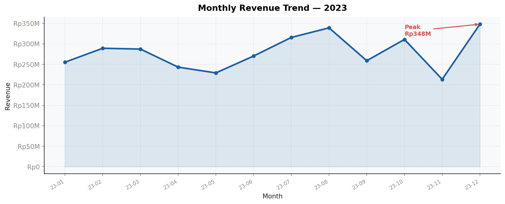
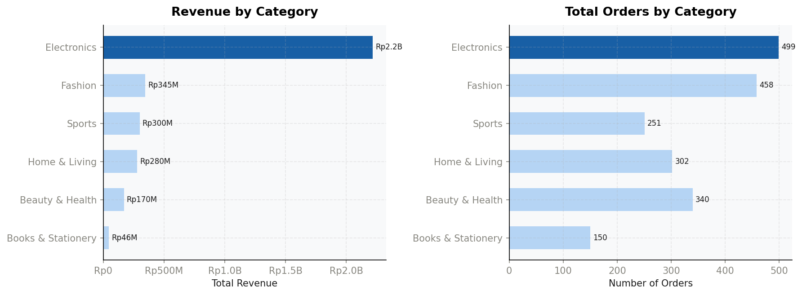
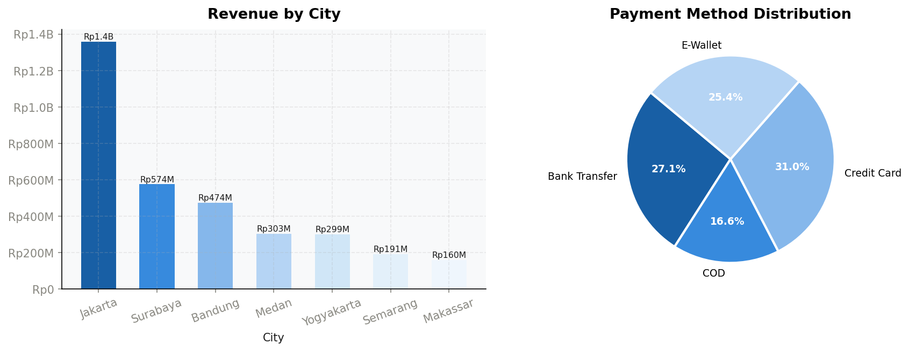

# 🛍️ E-Commerce Sales Analysis — Indonesia 2023

End-to-end exploratory data analysis on Indonesian e-commerce transaction data using Python. This project covers data cleaning, KPI analysis, visualization, and business insight generation.

---

## 📌 Objective

Analyze 2,000 e-commerce transactions to answer key business questions:
- Which product category generates the most revenue?
- Which city contributes the most to sales?
- What payment method do customers prefer?
- How does revenue trend across months and quarters?
- What is the order cancellation rate and what does it mean for the business?

---

## 📁 Repository Structure

```
ecommerce-sales-analysis/
│
├── ecommerce_sales_2023.csv          # Dataset (synthetic, 2000 transactions)
├── ecommerce_sales_analysis.ipynb    # Full analysis notebook
│
├── Screenshots/
│   ├── fig1_monthly_revenue.png      # Monthly revenue trend
│   ├── fig2_category_analysis.png    # Revenue & orders by category
│   ├── fig3_city_payment.png         # City revenue & payment method
│   └── fig4_status_quarterly.png     # Order status & quarterly revenue
│
└── README.md
```

---

## 📊 Key Findings

| # | Finding | Insight |
|---|---------|---------|
| 1 | **Electronics** leads in revenue | High unit price compensates for lower order volume |
| 2 | **Fashion** has the most orders | High demand but lower margin per item |
| 3 | **Jakarta** contributes ~35% of total revenue | Strong concentration — opportunity to grow Surabaya & Bandung |
| 4 | **E-Wallet** is the #1 payment method (28%) | Digital payment adoption is high among users |
| 5 | **Q3** is the peak revenue quarter | Likely driven by mid-year sales events |
| 6 | **12.8% cancellation rate** | Worth investigating checkout UX and payment drop-offs |

---

## 📈 Visualizations

### Monthly Revenue Trend


### Revenue & Orders by Category


### Revenue by City & Payment Method


### Order Status & Quarterly Revenue


---

## 🛠️ Tools & Libraries

| Tool | Purpose |
|------|---------|
| Python 3.10 | Core language |
| Pandas | Data manipulation & aggregation |
| NumPy | Numerical operations |
| Matplotlib | Data visualization |
| Seaborn | Statistical plotting |
| Jupyter Notebook | Interactive analysis environment |

---

## 🚀 How to Run

```bash
# Clone the repository
git clone https://github.com/zRILLL28/ecommerce-sales-analysis.git
cd ecommerce-sales-analysis

# Install dependencies
pip install pandas numpy matplotlib seaborn jupyter

# Open notebook
jupyter notebook ecommerce_sales_analysis.ipynb
```

---

## 👤 Author

**Yusril Arbizal**  
[LinkedIn](https://linkedin.com/in/yusril-arbizal) · [GitHub](https://github.com/zRILLL28)
